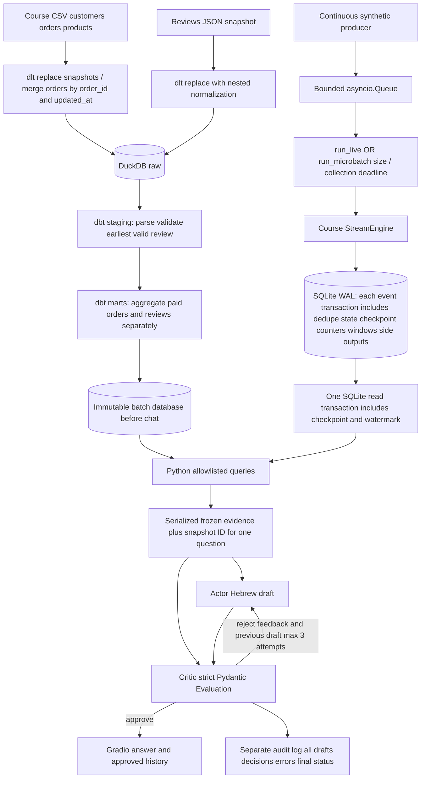

# Implementation architecture

```mermaid
flowchart TD
    A[Course CSV customers orders products] --> B[dlt replace snapshots / merge orders by order_id and updated_at]
    R[Reviews JSON snapshot] --> C[dlt replace with nested normalization]
    B --> D[(DuckDB raw)]
    C --> D
    D --> E[dbt staging: parse validate earliest valid review]
    E --> F[dbt marts: aggregate paid orders and reviews separately]
    F --> G[(Immutable batch database before chat)]
    P[Continuous synthetic producer] --> Q[Bounded asyncio.Queue]
    Q --> M[run_live OR run_microbatch size / collection deadline]
    M --> N[Course StreamEngine]
    N --> S[(SQLite WAL: each event transaction includes dedupe state checkpoint counters windows side outputs)]
    G --> T[Python allowlisted queries]
    S --> U[One SQLite read transaction includes checkpoint and watermark]
    U --> T
    T --> V[Serialized frozen evidence plus snapshot ID for one question]
    V --> W[Actor Hebrew draft]
    V --> X[Critic strict Pydantic Evaluation]
    W --> X
    X -->|reject feedback and previous draft max 3 attempts| W
    X -->|approve| Y[Gradio answer and approved history]
    X --> Z[Separate audit log all drafts decisions errors final status]

```
